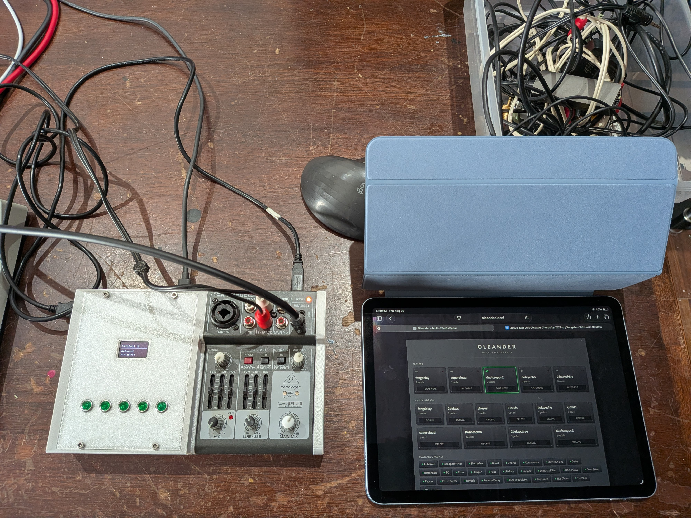
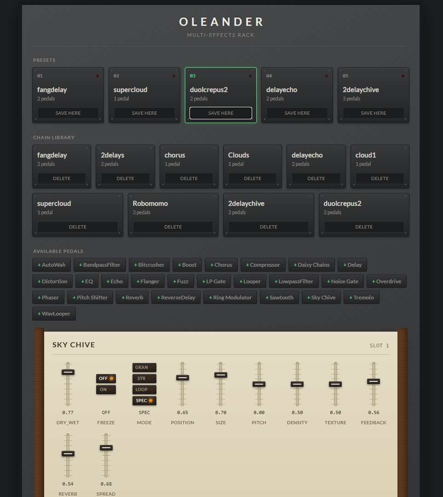
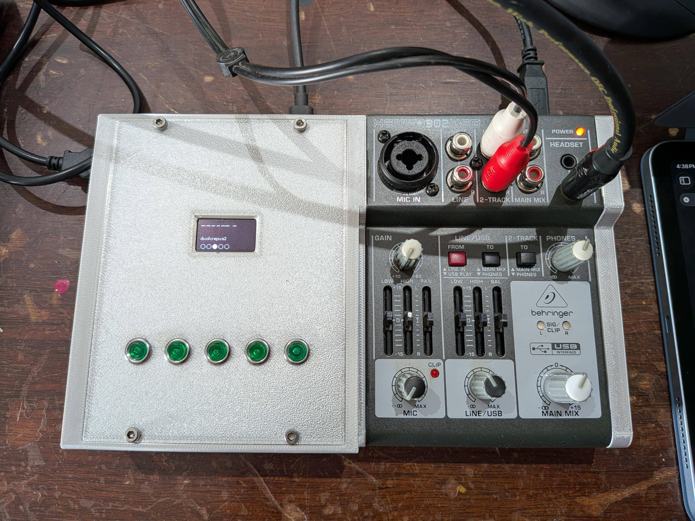

# Oleander - Multi-Effects Pedal

A Raspberry Pi 4-based multi-effects pedal system built for synth players and dawless jammers, forked from [GuitarEffects](https://github.com/Quinny/GuitarEffects).



## Features

- Real-time audio effects chain (delay, reverb, granular texture, distortion, compression, filters, and more)
- Vintage-synth-style control surface — vertical faders and LED pushbuttons, not a generic web form
- Web-based control via `http://oleander.local` in any browser
- 5 latching microswitches for physical pedal on/off control (optional — see [Hardware](#hardware))
- SSD1306 OLED display showing active pedal name, knob values, and status (optional)
- Minimal build is just a Raspberry Pi and a USB audio interface — no soldering or extra parts required to get the full effects chain running through the web UI
- Headless operation via systemd service
- Works with any class-compliant USB audio interface (developed and tested on a Behringer XENYX 302USB, but not tied to it)
- One-click setup script

## Quick Start

```bash
# Clone the repo
git clone <repo-url> oleander-effects
cd oleander-effects

# Run the setup script (requires sudo)
sudo ./setup/install.sh

# Reboot to apply I2C changes
sudo reboot

# Start the service
sudo systemctl start oleander

# Open http://oleander.local in your browser
```

## Web UI



Every pedal, knob, and preset is reachable from the browser — the physical buttons and OLED (below) are a nice-to-have for hands-free control while playing, not a requirement.

## Hardware



- **Compute:** Raspberry Pi 4
- **Audio:** Any class-compliant USB audio interface (built and tested with a Behringer XENYX 302USB; any USB audio interface Linux/ALSA recognizes should work)
- **Display (optional):** SSD1306 128x64 OLED (I2C)
- **Controls (optional):** 5x latching microswitches on GPIO

A Raspberry Pi and a USB audio interface are all that's required — the OLED and switches are an optional add-on for physical, on-the-floor control; everything they do is also available from the web UI. Skip them and just don't start/enable `oleander-hardware.service` (`setup/install.sh` always installs it but never starts it automatically) to run web-UI-only.

See [docs/HARDWARE.md](docs/HARDWARE.md) for wiring diagrams and component details. 3D-printable enclosure files (`case/oly_bod.stl`, `case/oly_lid.stl`) are in `case/`.

## Architecture

```
Web Browser ──▶ Oleander Server (C++/Crow) ──▶ USB Audio I/O
                ▲                              │
                │   hardware_service.py        │
                │   (optional)                 │
                └──────────────────────────────┘
                            │
                    SSD1306 OLED (optional)
                    5x Latching Switches (optional)
```

## Documentation

- [docs/PROJECT.md](docs/PROJECT.md) — project overview and architecture
- [docs/HARDWARE.md](docs/HARDWARE.md) — wiring diagrams, BOM, troubleshooting
- [docs/SOFTWARE.md](docs/SOFTWARE.md) — software architecture and implementation plan
- [docs/codefix.md](docs/codefix.md) — history of bugs found and fixed
- [docs/THIRD_PARTY.md](docs/THIRD_PARTY.md) — third-party code and licenses

## License

GPL-3.0 (based on GuitarEffects by Quinny)
